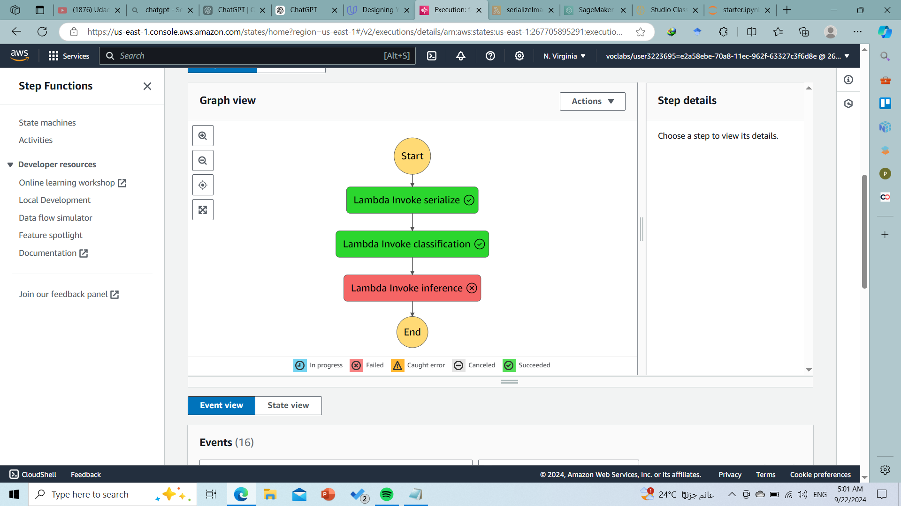

# Build a ML Workflow for Scones Unlimited on Amazon SageMaker

##  Project Overview  
This repository contains a complete machine learning workflow built for the fictional company *Scones Unlimited*, as part of the **Udacity AWS ML Fundamentals Nanodegree**. The project integrates Amazon SageMaker with AWS Step Functions and Lambda, demonstrating a scalable and automated ML pipeline for image classification.

##  Key Features  
- End-to-end ML pipeline using **Amazon SageMaker**, **Step Functions**, and **Lambda**  
- Training and inference workflows orchestrated through **AWS Step Functions**  
- Real-time inference via Lambda functions  
- Error handling and state tracking with visual diagrams of success and failure workflows

##  Repository Structure  
├── starter.ipynb # Jupyter notebook for training model and defining the pipeline
├── lambda1.py # Lambda function for invoking inference endpoint
├── lambda2.py # Lambda function for intermediate processing
├── lambda3.py # Lambda function for final inference steps
├── step_function_definition.json # AWS Step Functions workflow definition
├── successful_state_machine.png # Visualization of the successful execution workflow
├── failed_state_machine.png # Visualization of workflow behavior during failures
├── train.lst # Sample training data list
├── test.lst # Sample testing data list
└── .ipynb_checkpoints # Jupyter notebook checkpoints (can be ignored)

##  Getting Started

### Prerequisites
- AWS account with permissions for SageMaker, Step Functions, Lambda  
- Python 3.7+ and AWS CLI configured  
- Jupyter Notebook environment

### Setup Instructions
1. **Clone the repository**  
   ```bash
   git clone https://github.com/Emily-Essam/Build-a-ML-Workflow-For-Scones-Unlimited-On-Amazon-SageMaker-Udacity.git
   cd Build-a-ML-Workflow-For-Scones-Unlimited-On-Amazon-SageMaker-Udacity
2. **Install dependencies**  
   Ensure you have the necessary AWS SDKs (e.g., **Boto3**) installed.  

3. **Run `starter.ipynb`**  
   This notebook guides you through:  
   - Preparing and uploading data to **S3**  
   - Training a model in **SageMaker**  
   - Deploying an endpoint for inference  

4. **Deploy the AWS Step Functions workflow**  
   Use `step_function_definition.json` to create and configure the state machine that orchestrates your ML pipeline.  

5. **Invoke inference via Lambda functions**  
   Test real-time inference using the Lambda functions (`lambda1.py`, `lambda2.py`, `lambda3.py`) connected to your Step Functions pipeline.  
## 📊 Workflow Visualization  

- **Successful Path**:  
    
  Illustrates the flow when everything proceeds as expected.  

- **Failed Path**:  
    
  Shows how failures are handled and traced within the state machine.  

---

## 🌟 Project Highlights  

- Demonstrates a production-ready ML deployment pipeline.  
- Incorporates best practices in orchestration, error handling, and AWS integration.  
- Emphasizes automation and reliability in machine learning workflows.  

---

## 🙌 Acknowledgements  

Thanks to **Udacity** for guiding this project through their AWS ML Nanodegree, and to **AWS SageMaker, Step Functions, and Lambda** for enabling scalable deployment and orchestration.  
   
